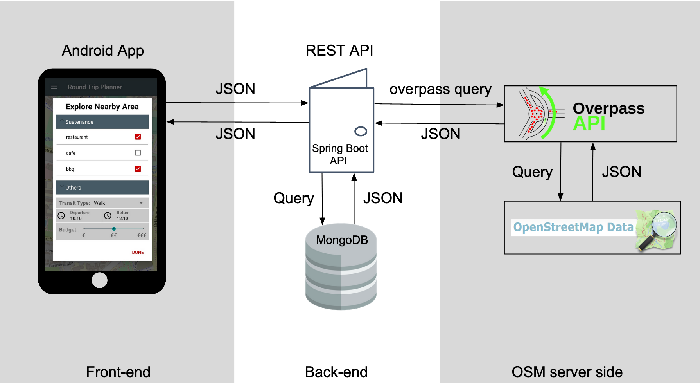
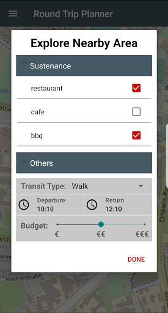
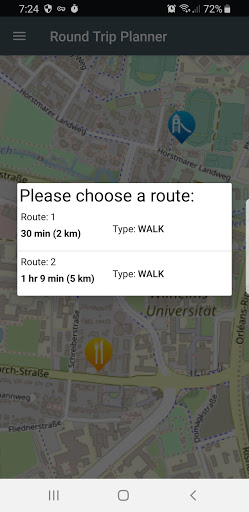
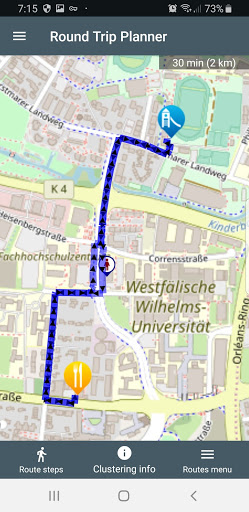
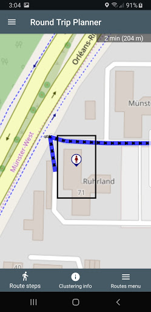
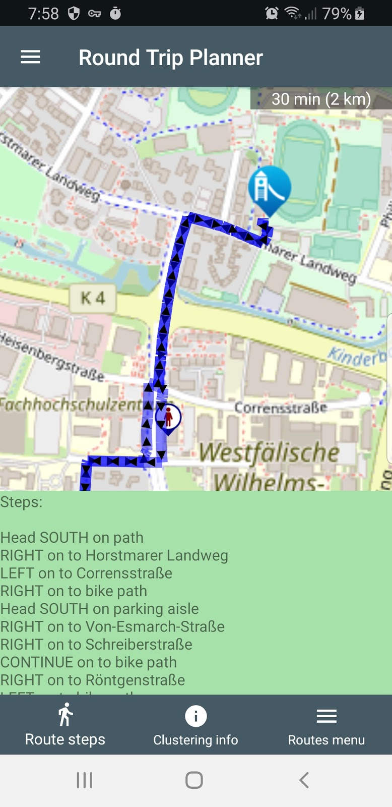
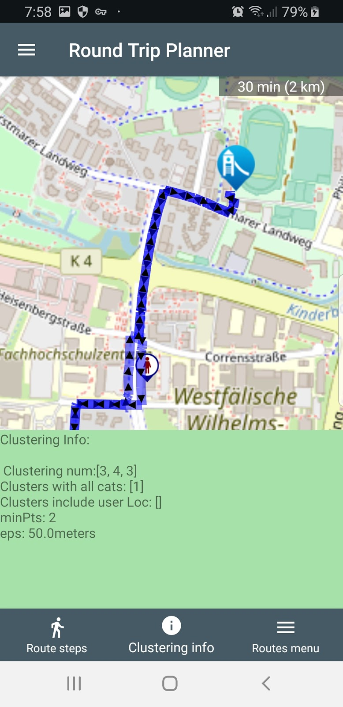

# round-trip-planner

The project is an Android navigation mobile application I developed during my internship at [JARACO Gmbh](http://www.jaraco.de/). It uses free and high quality OpenStreetMap (OSM) data to generate multiple routes according to user preferences including transit type and time to go & return. Also, it allows users to specify more than one destination to create a round route that starts and ends with user location point.
 The project involved developing backend-side using (MongoDB, Spring Framework, RESTful API, Maven, Docker, IntelliJ IDEA, Overpass API) and frontend-side using (Java, MVVM, Gradle, Android Room, Android Studio), and clustering geodata to identify areas with rich density of points. Also, creating unit and integration tests using (JUnit & Espresso) to verify the functionality and quality of the application.

## Application Architecture

## Functionalities

### Choose categories of interes, transit type, time to spend and budget

### Generate and display available routes based on user preferences 

### Display route selected

### Track user locatoin within route

### Show navigation steps

### Show clustering info

## Source Code

Source code is in a private GitHub repository upon company's request

